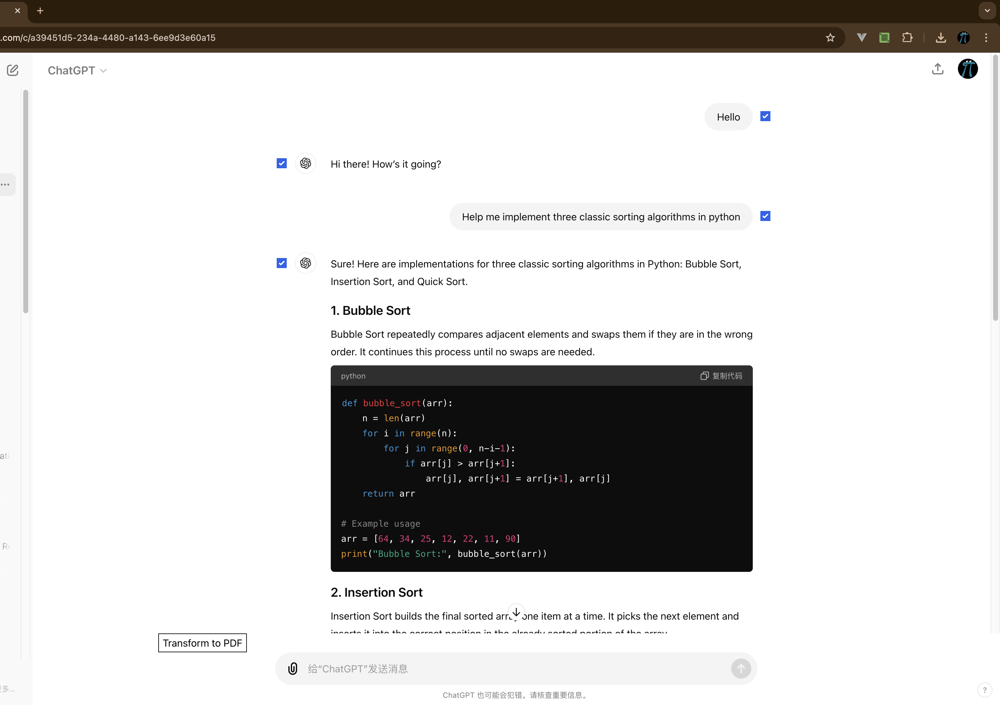
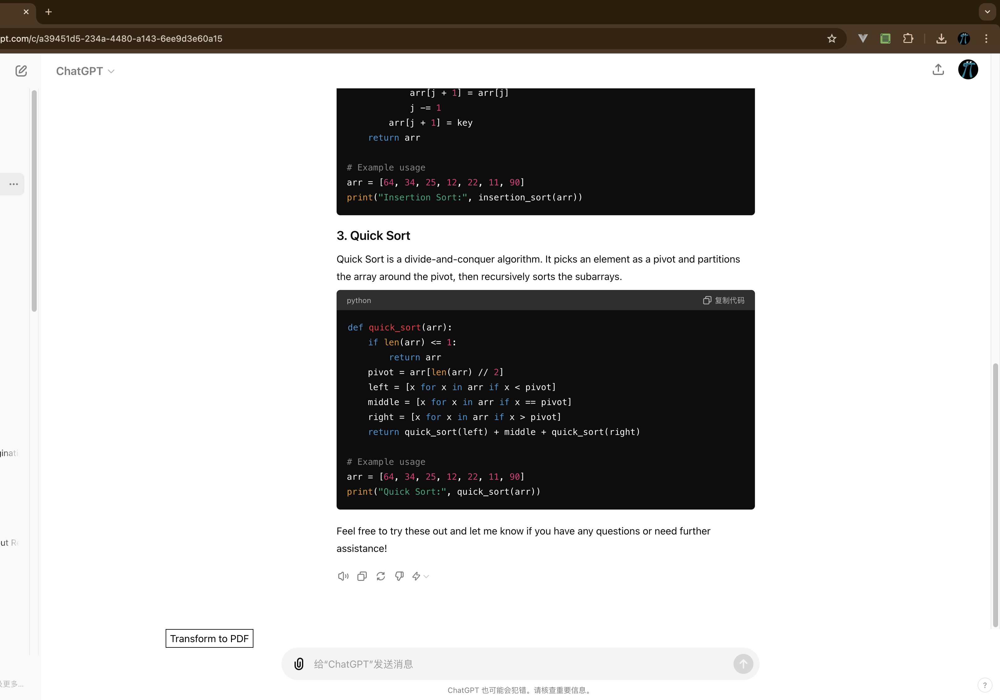
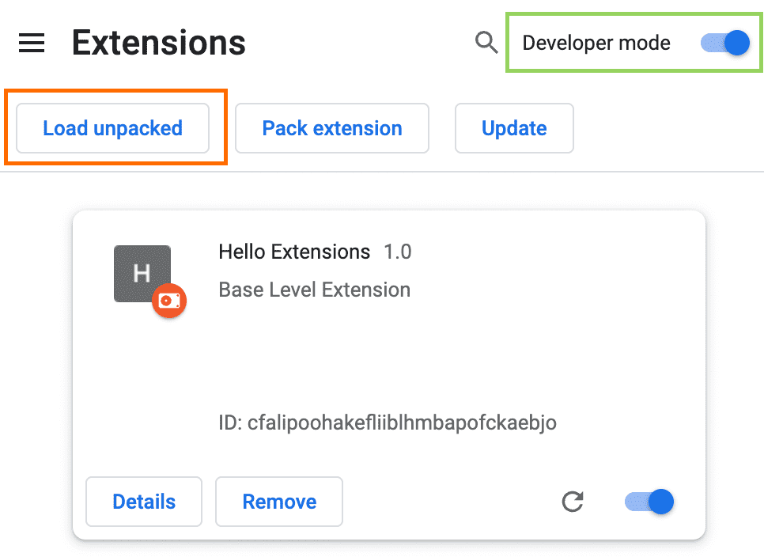

# ChatPrint
> Turn your chatgpt answer to pdf

## before:

> you can click the checkbox near the Question or Answer provided by ChatGPT, then click the Transform to PDF button, then the PDF file will be downloaded

## after:
[after transform](static-files/my-document.pdf)

## how to install
1. clone the repository, enter the **chrome://extensions** in your chrome browser.
2. Enable Developer Mode by clicking the toggle switch next to Developer mode.
3. Click the Load unpacked button and select the extension directory, like below.

